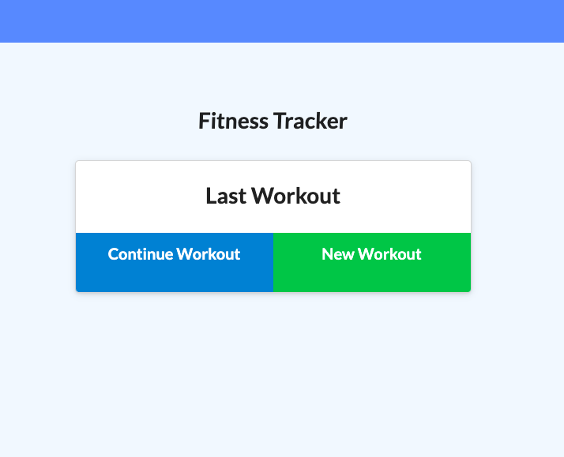
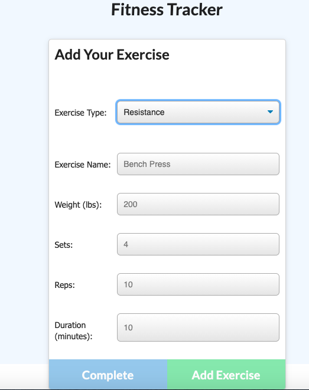
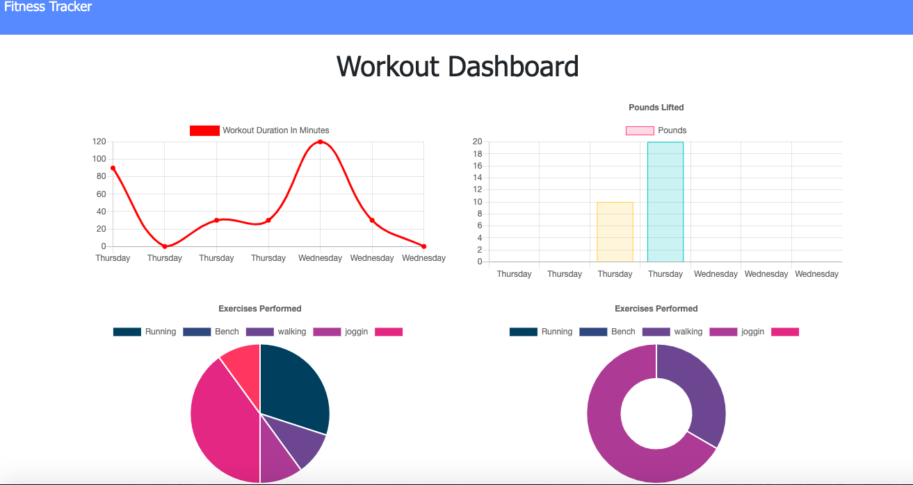

# Workout Tracker
Track your workout with this App! It allows you to add new workouts and see your improcement over time. The charts helps to track pounds lift and workout durations. 

# How it works
To run this application you will need to install the fallowing:

* Install NPM
* Mongoose  NMP Package
* Express NMP Package
* MongoDB
* React

# Screenshot

# Heruko Link

* Links: https://jscworkout-tracker.herokuapp.com 

